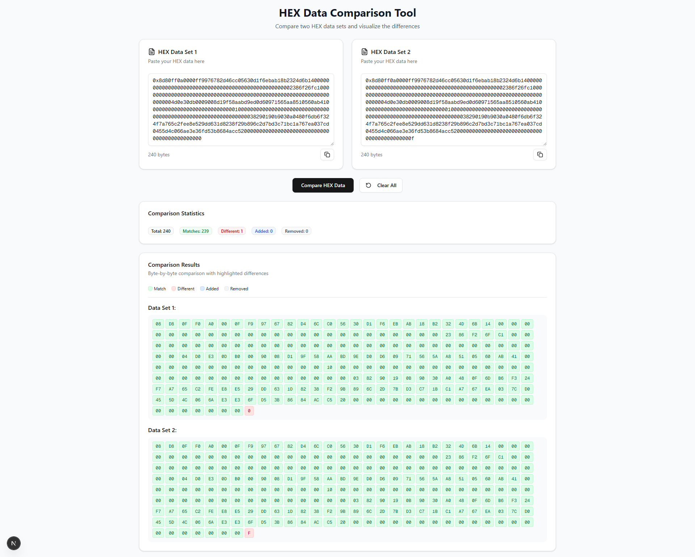

# 🔍 HEX Comparison Tool

A modern web-based utility for comparing two HEX data sets byte-by-byte. This tool visually highlights matches, differences, additions, and removals with a clean UI built using **Next.js** and **ShadCN UI**.

## ✨ Features

- 🧠 **Smart HEX parsing**: Automatically formats and normalizes raw HEX input.
- 🧾 **Byte-by-byte diffing**: Highlights differences with color-coded chips.
- 📊 **Detailed stats**: Summary of matches, differences, additions, and deletions.
- 🧹 **Clear & copy**: Easily copy or reset your input fields.
- 📱 **Responsive UI**: Fully responsive design for desktop and mobile devices.

## 📸 Preview



## 🚀 Getting Started

### 1. Clone the repository

```bash
git clone https://github.com/zntb/nextjs-hex-compare-tool.git
cd hex-compare-tool
```

### 2. Install dependencies

```bash
pnpm install
# or
npm install
# or
yarn install
```

### 3. Start the development server

```bash
pnpm dev
# or
npm run dev
# or
yarn dev
```

### 4. Open the app in your browser

Open [http://localhost:3000](http://localhost:3000) in your browser.

### 🛠️ Tech Stack

- Next.js

- React

- TypeScript

- ShadCN UI

- Tailwind CSS

- Lucide Icons

## 📝 License

This project is licensed under the [MIT License](LICENSE).
